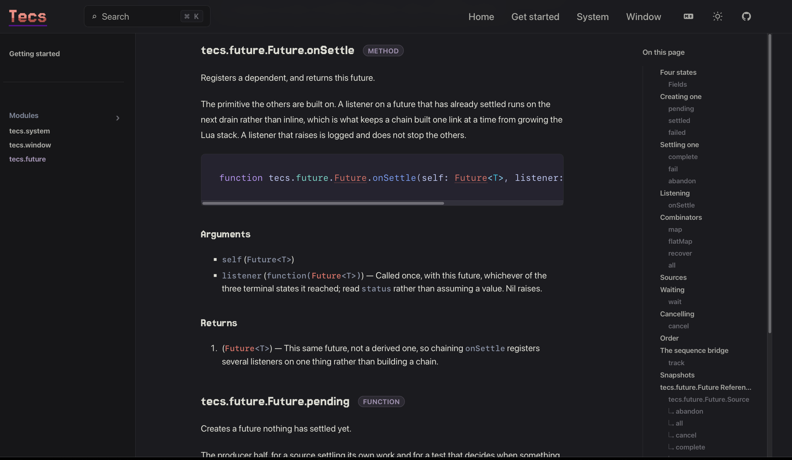

<a id="$docs.header"></a>

# Tealdoc

> [!WARNING]
> Tealdoc is currently in alpha. Expect bugs, missing functionality, and breaking changes.

A documentation generator written in [Teal](github.com/teal-language/tl/tree/master).

Its primary function is to generate documentation for programs written in Teal, but it is extensible enough to support other languages.

## Table of Contents

- [Installation](#installation)
- [How to Document Your Code](#how-to-document-your-code)
    - [Tealdoc Comments](#tealdoc-comments)
    - [Anatomy of a Comment](#anatomy-of-a-comment)
    - [Functions](#functions)
    - [Records and Interfaces](#records-and-interfaces)
    - [Enums](#enums)
    - [Variables and Types](#variables-and-types)
    - [Controlling Visibility](#controlling-visibility)
- [CLI Reference](#cli-reference)
    - [Commands](#commands)
    - [Options](#options)
    - [Project Configuration](#project-configuration)
    - [Static Site Output](#static-site-output)
        - [Quick start](#quick-start)
        - [Complete configuration example](#complete-configuration-example)
        - [Content sources](#content-sources)
        - [Configuration reference](#configuration-reference)
        - [Per-property site configuration](docs/site_configuration.md)
        - [Pages and routes](#pages-and-routes)
        - [Navigation, search, and validation](#navigation-search-and-validation)
        - [Output and hosting](#output-and-hosting)
        - [Templates](#templates)
        - [Home pages](#home-pages)
        - [Checked examples and source regions](#checked-examples-and-source-regions)
        - [Markdown content](#markdown-content)
        - [Generated API references](#generated-api-references)
        - [Syntax highlighting and theming](#syntax-highlighting-and-theming)
        - [Redirects](#redirects)
        - [Admonitions](#admonitions)
        - [Build hooks](#build-hooks)
- [Architecture](#architecture)
    - [Using Tealdoc Programmatically](#using-tealdoc-programmatically)
    - [Adding Custom Tags](#adding-custom-tags)
    - [Plugins](#plugins)
- [API Reference](#api-reference)
- [About](#about)

<a id="$docs.installation"></a>

## Installation

Tealdoc can be installed using [Luarocks](https://luarocks.org/):

```
luarocks install tealdoc
```

### From a checkout

The generated Lua is not committed, so a checkout carries Teal only. `make
build` compiles it, and every target that needs it already depends on that:

```
make install   # deps, build, then luarocks make
make check     # the specs and the documentation smoke test
```

`luarocks make` on its own fails on a fresh checkout, because the rockspec
names compiled modules and nothing has compiled them yet. Run `make build`
first, or use `make install`, which does.

A release is `make dist`: it compiles, stages the Teal beside the Lua, tars
them together and writes the rockspec that names the tarball. The published
rock carries both, so a project depending on tealdoc can run it and type-check
against it.

<a id="$docs.tutorial"></a>

## How to Document Your Code

### Tealdoc Comments

Documentation can be written in special comments that begin with three hyphens (`---`).

```
--- This is a Tealdoc summary line.
--- The rest of the comment forms the detailed description.
--- It can span multiple lines.

---
-- This is also a valid Tealdoc comment.
```

You can also use a block comment.

```
--[[--
    This is a Tealdoc block comment.
    ...
]]--
```

### Anatomy of a Comment

All documentation comments start with a brief summary sentence that ends with a period. The text that follows the summary becomes the detailed description.

After the description, you can add tags, which start with an `@`. Tags may optionally include a parameter and a description.

```
--- This is the summary. This is the detailed description.
-- @tag_name parameter The description for this tag.
-- @another_tag
```

### Functions

Document functions by placing a Tealdoc comment directly above them. Parameter and return types are inferred automatically from the function's type annotations.

```
--- Adds two integers.
-- This function adds two integers together.
-- @param a The first integer to add.
-- @param b The second integer to add.
-- @return The sum of the two integers.
function test.foo(a: integer, b: integer): integer
    return a + b
end
```

Function types used in declarations and record fields may not provide
parameter names to Tealdoc. Put `@param` tags on the declaration instead of
placing documentation comments inside the function type:

```
global record script
    --- Registers a function to run during mod initialization.
    --- @param handler The event handler. Passing nil unregisters it.
    on_init: function(function())
end
```

Tealdoc matches tags for unnamed parameters by declaration order and uses each
tag's parameter name in the generated documentation. When a function type has
multiple unnamed parameters, write its `@param` tags in the same order.

You can use multiple `@return` tags to document functions with multiple return values:

```
--- Fetches messages from the server.
-- @return A table of messages if successful.
-- @return An error message on failure.
function client.fetch_messages(): {Message}, string
    ...
end
```

Use the `@typearg` tag to document generic type variables:

```
--[[--
    Calculates the area of a shape.
    @typearg S The type of the shape, which must implement `Shape`.
    @param shape The shape object.
    @return The area of the shape.
]]
local function area<S is Shape>(shape: S): number
    ...
end
```

### Records and Interfaces

You can document records, interfaces, and all of their fields and nested types.

```
--- An abstract representation of a shape.
interface Shape
    --- The result type of any geometric calculation.
    --- Either a `double` value or an error string.
    type calculation_result = double | string

    --- The number of sides.
    sides: integer
end

--- A square shape.
record Square is Shape
    --- The length of the square's side in cm.
    side_length: double

    --- Calculates the square's diagonal.
    --- @return The diagonal length in cm.
    get_diagonal: function(shape): calculation_result
end
```

Functions can also be documented where they are defined, if outside the initial record definition:

```
--- Multiplies the length of all sides of the square.
-- @param x The factor to multiply by.
function Square:multiply_sides(x: number)
    ...
end
```

**Note:** If a function has documentation at both its declaration and its
definition, the declaration's documentation is retained by default and a
warning identifies the item and retained comment. The project-wide
`tealdoc.doc_precedence` setting can instead retain the definition or treat
the duplicate documentation as an error.

### Enums

Enum types and their values can be documented:

```
--- Classifies a triangle by its side lengths.
enum TriangleType
    --- All sides are equal.
    "equilateral"
    --- Two sides are equal.
    "isosceles"
    --- No sides are equal.
    "scalene"
end
```

### Variables and Types

You can also document variables and type declarations:

```
--- The mathematical constant PI, rounded to two decimal places.
global PI = 3.14

--- A type alias for a numeric value.
local type Numeric = number | integer
```

### Controlling Visibility

By default, Tealdoc includes all of the module's contents and all global functions in the generated documentation.

*   To **exclude** an item, add the `@local` tag to its documentation comment.
*   A member whose name starts with one underscore, such as `_cache`, is
    private by convention and excluded. Add `@public` to opt that member into
    the documentation. Double-underscore names such as `__call` and the
    conventional public `_VERSION` constant are not hidden.
*   To **include** local items that would normally be excluded, use the `--all` command-line flag or set `env.include_all = true` when using the API.

If there are multiple conflicting declarations (e.g., two global functions with the same name), the last one processed is chosen, and a warning is emitted if a Tealdoc comment from a previous declaration is ignored as a result.

### Categories
You can add `@category <category_name>` tags to your module members to group them into categories. This can help organize your documentation and make it easier to navigate.
```
local record Logger
    --- @category callbacks
    on_message: function(message: string)

    --- @category methods
    log: function(self, message: string)

    --- @category methods
    error: function(self, message: string)
end
```


<a id="$docs.cli_reference"></a>

## CLI Reference

To use the Tealdoc command-line interface:

```
tealdoc <command> [options]
```

You can view all available commands and options with:

```
tealdoc --help
```

### Commands
*   `md`: Generate documentation as a Markdown file.
*   `html`: Generate documentation as an HTML file.
*   `site`: Generate an opt-in static documentation site.
*   `dump`: Print the internal documentation registry to the console for debugging.

### Options
*   `--output <file>`: Specifies the output file for the generated documentation.
*   `--all`: Includes local definitions in the output.
*   `--plugin <plugins>`: Plugins to load; plugin names are resolved the same way as lua requires.
*   `--no-warn-missing`: Suppresses warnings about missing documentation for items.
*   `-V, --version`: Prints the Tealdoc version and exits.

Command and configuration errors are written as concise diagnostics without a
Lua traceback, and the process exits with a nonzero status.

### Project Configuration

Tealdoc reads its project settings from the `tealdoc` table in the nearest
`tlconfig.lua`, using the same current-directory and parent-directory search as
Teal. The namespace lets Tealdoc add settings without colliding with compiler
or other tool settings.

`tealdoc.doc_precedence` controls duplicate function documentation across
ordinary and record functions. It accepts `"declaration"`, `"definition"`, or
`"error"` and defaults to `"declaration"`:

```lua
return {
    tealdoc = {
        doc_precedence = "declaration",
    },
}
```

When both a function declaration and its definition have Tealdoc comments,
`"declaration"` retains the declaration comment and `"definition"` retains the
definition comment. Both modes warn with the canonical item path and the
comment retained. `"error"` stops generation with the item path instead of
choosing one. A declaration remains documented when only its comment exists,
and a definition remains documented when only its comment exists.

Programmatic users set the same policy on an environment before processing
source:

```lua
local env = tealdoc.Env.init()
env.doc_precedence = "definition"
```

`Env.init()` defaults to `"declaration"`. The CLI reads `tlconfig.lua` only
after handling `--version`, so version reporting never executes project
configuration.

For Markdown output, `markdown.type_links` can map canonical Tealdoc path
prefixes to URL prefixes:

```lua
local base = os.getenv("DOCS_BASE") or ""

return {
    source_dir = "src",
    tealdoc = {
        markdown = {
            type_links = {
                ["my.http"] = base .. "/modules/http#my.http",
                ["my.Future"] = base .. "/modules/future#my.future.Future",
            },
        },
    },
}
```

The exact path links to the page before `#`. A descendant appends its suffix
to the complete URL prefix, so `my.http.Response` above links to
`/modules/http#my.http.Response`. Types with no route remain plain code.

For complete control, the configuration can instead return a resolver
function. It receives a canonical type path and returns its URL, or `nil` when
the type should remain unlinked:

```lua
return {
    tealdoc = {
        markdown = {
            type_links = function(path)
                if path == "external.Widget" then
                    return "https://example.com/widget"
                end
            end,
        },
    },
}
```

`tlconfig.lua` is loaded and executed as trusted Lua code. Markdown cannot
contain links inside fenced code blocks, so Tealdoc keeps signatures as valid,
syntax-highlighted Teal and applies type links in the structured Arguments and
Returns sections.

### Static Site Output

`tealdoc site` composes handwritten Markdown and generated API reference into
a responsive static site. It does not replace `tealdoc md`; site generation is
an explicit command with its own `tealdoc.site` configuration:



#### Quick start

A site needs a title and at least one page or example. API sources are
optional, so the smallest useful site can be entirely handwritten:

```lua
return {
    tealdoc = {
        site = {
            title = "My project",
            pages = {
                {
                    path = "",
                    title = "Home",
                    source = "docs/index.md",
                },
            },
        },
    },
}
```

Build it with:

```sh
tealdoc site --output site
```

Add `sources` and an `api` page when the site should include generated Teal
reference documentation:

```lua
site = {
    title = "My project",
    sources = { "src/my/api.tl" },
    pages = {
        {
            path = "api",
            title = "API",
            source = "docs/api.md",
            api = "my.api",
        },
    },
}
```

#### Complete configuration example

The following example shows content, navigation, hosting, theming, and
extension settings together. The sections after it document each concern
independently.

<details>
<summary>Show the complete configuration</summary>

```lua
return {
    tealdoc = {
        site = {
            title = "My project",
            -- Set name = "" for a logo-only header.
            name = "My project",
            description = "Project documentation",
            language = "en",
            base = "/",
            site_url = "https://docs.example.com",
            logo = "/images/logo.svg",
            github = "https://github.com/example/my-project",
            favicon = "favicon.svg",
            public = "docs/public",
            cname = "docs.example.com",
            author = "My project contributors",
            social_image = "/images/social-card.png",
            twitter_site = "@myproject",
            head = {
                {
                    tag = "meta",
                    attributes = {
                        name = "theme-color",
                        content = "#137a7f",
                    },
                },
            },
            custom_css = "docs/site.css",
            format_generated_code = true,
            templates = "docs/templates",
            copyright = "Copyright My project contributors",
            license = "MIT licensed",
            sources = {
                "src/my/api.tl",
                "src/my/widgets",
            },
            footer_links = {
                { text = "Notices", path = "notices" },
                { text = "MIT License", path = "license" },
            },
            not_found = {
                title = "Page not found",
                description = "The requested page does not exist.",
                source = "docs/404.md",
            },
            redirects = {
                ["old-api.html"] = "api",
            },
            nav = {
                { text = "Home", path = "" },
                { text = "API", path = "api" },
            },
            sidebar = {
                {
                    text = "Reference",
                    items = {
                        { path = "api" },
                    },
                },
            },
            pages = {
                {
                    path = "",
                    title = "Home",
                    source = "docs/index.md",
                    layout = "home",
                    hero_title = "My project",
                    hero_text = "A short introduction.",
                    hero_image = "/images/project.png",
                    hero_image_alt = "My project",
                    hero_actions = {
                        { text = "Get started", path = "guide", theme = "brand" },
                        { text = "API", path = "api", theme = "alt" },
                    },
                    features = {
                        {
                            icon = "✓",
                            title = "Typed",
                            details = "Checked examples and linked API types.",
                        },
                    },
                },
                {
                    path = "api",
                    title = "API",
                    source = "docs/api.md",
                    api = "my.api",
                },
            },
            before_build = function(context)
                -- Adjust page metadata before rendering.
            end,
            after_build = function(context)
                -- Generate a sitemap or other final artifact.
            end,
        },
    },
}
```

</details>

#### Content sources

A site can combine four kinds of content:

- Teal modules discovered through `sources`;
- handwritten Markdown selected by page `source` fields;
- generated API references selected by page `api` fields; and
- checked Teal or Lua source regions named by canonical API paths.

Each page can use one or both of `source` and `api`. `api` accepts either one
module name or an ordered list of modules projected under the page's required
`public` namespace. Tealdoc rejects duplicate projected public paths and links
only exact items rendered by an API page. Tealdoc renders the handwritten
material first, then the generated reference. A module page can
therefore explain concepts, examples, and caveats without manually maintaining
an exhaustive API list.

##### Teal API sources

`sources` accepts Teal files and directories. Directories are searched
recursively for `.tl` files in deterministic order. Command-line files are
added to the configured sources, so a project can keep its normal inputs in
configuration and add a one-off module for a particular build:

```sh
tealdoc site --output site src/my/experimental.tl
```

All configured filesystem paths are relative to the discovered
`tlconfig.lua`, not the directory from which `tealdoc` was invoked. This
includes `sources`, page and example `source` values, `custom_css`, and
`templates`, plus `public` and the custom 404 `source`. The `--output` path
and command-line Teal files remain relative to the invoking directory.

#### Configuration reference

Tealdoc rejects unknown setting names. Every setting below links to its own
reference section with its type, behavior, and a minimal example. Compound
settings document their complete nested table shape.

| Setting | Default | Meaning |
| --- | --- | --- |
| [`title`](docs/site_configuration.md#title) | required | Project name used in document titles. |
| [`name`](docs/site_configuration.md#name) | `title` | Header wordmark; use `""` for a logo-only header. |
| [`description`](docs/site_configuration.md#description) | `""` | Fallback page description. |
| [`language`](docs/site_configuration.md#language) | `"en"` | HTML language and Open Graph locale. |
| [`base`](docs/site_configuration.md#base) | `"/"` | Root URL path. |
| [`site_url`](docs/site_configuration.md#site_url) | omitted | HTTP(S) origin used for canonical URLs and the sitemap. |
| [`logo`](docs/site_configuration.md#logo) | omitted | Header logo URL. |
| [`github`](docs/site_configuration.md#github) | omitted | GitHub repository URL shown in the header. |
| [`favicon`](docs/site_configuration.md#favicon) | omitted | Favicon URL. |
| [`public`](docs/site_configuration.md#public) | omitted | Config-relative static asset directory. |
| [`cname`](docs/site_configuration.md#cname) | omitted | Bare DNS name written to `CNAME`. |
| [`head`](docs/site_configuration.md#head) | `{}` | Escaped `meta` and `link` entries. |
| [`author`](docs/site_configuration.md#author) | omitted | Author metadata. |
| [`social_image`](docs/site_configuration.md#social_image) | omitted | Default social image. |
| [`twitter_site`](docs/site_configuration.md#twitter_site) | omitted | Twitter account metadata. |
| [`sitemap`](docs/site_configuration.md#sitemap) | `site_url ~= nil` | Generate `sitemap.xml`. |
| [`robots`](docs/site_configuration.md#robots) | `true` | Generate `robots.txt`. |
| [`not_found`](docs/site_configuration.md#not_found) | omitted | Custom 404 page. |
| [`custom_css`](docs/site_configuration.md#custom_css) | omitted | Project stylesheet. |
| [`templates`](docs/site_configuration.md#templates) | omitted | Template override directory. |
| [`copyright`](docs/site_configuration.md#copyright) | omitted | Escaped footer copyright. |
| [`license`](docs/site_configuration.md#license) | omitted | Escaped footer license. |
| [`footer_links`](docs/site_configuration.md#footer_links) | `{}` | Structured footer links. |
| [`redirects`](docs/site_configuration.md#redirects) | `{}` | Old route to destination mappings. |
| [`sources`](docs/site_configuration.md#sources) | `{}` | Teal source files and directories. |
| [`pages`](docs/site_configuration.md#pages) | `{}` | Handwritten and API pages. |
| [`sidebar`](docs/site_configuration.md#sidebar) | derived | Explicit recursively nested sidebar. |
| [`sidebar_open`](docs/site_configuration.md#sidebar_open) | all | Sections initially open by path or text. |
| [`validate_links`](docs/site_configuration.md#validate_links) | `true` | Validate internal links and anchors. |
| [`format_generated_code`](docs/site_configuration.md#format_generated_code) | `false` | Format generated Teal with Cerulean. |
| [`constructor_pattern`](docs/site_configuration.md#constructor_pattern) | omitted | Lua pattern that classifies constructor functions. |
| [`nav`](docs/site_configuration.md#nav) | `{}` | Header navigation link tables. |
| [`before_build`](docs/site_configuration.md#before_build) | omitted | Pre-render build hook. |
| [`after_build`](docs/site_configuration.md#after_build) | omitted | Post-render build hook. |

At least one page is required, but Teal sources are not. A
Markdown-only site is a supported zero-Teal build.

#### Pages and routes

##### Page content

Page settings are `path`, required `title`, `description`, `source`, `api`,
`public`, `layout`, `hero_title`, `hero_text`, `hero_image`,
`hero_image_alt`, `hero_actions`, `features`, `canonical`, `image`, and
`noindex`. An action or navigation link has required `text` and `path`, plus
optional `theme`. A feature has required `title` and optional `details`,
`icon`, and `image`.

##### Route rules

Page paths are clean URL routes rather than filesystem paths.
Leading and trailing slashes and repeated separators normalize away. A route
cannot contain `.`, `..`, a query, or a fragment. Page and redirect
sources must remain unique after normalization. Tealdoc rejects a conflict
before writing page output. Relative redirect destinations use `base`;
absolute paths and HTTP(S) destinations are preserved.

#### Navigation, search, and validation

The default layout provides desktop navigation, a left page sidebar, a right
page outline, breadcrumbs, previous and next links, heading permalinks, and
JavaScript-free mobile navigation and light/dark controls. The optional logo is
a URL, while `github` adds the GitHub header action. Set `name` to an empty
string for a logo-only header, omit `logo` for text only, or provide both.
`nav` is an ordered array of link tables. Each entry requires `text` and
`path`; paths may be site routes, absolute paths, or external URLs:

```lua
nav = {
    { text = "Guide", path = "guide" },
    { text = "API", path = "reference/api" },
    { text = "Community", path = "https://example.com/community" },
}
```

Set `sidebar` when route-derived grouping is not expressive enough. It is a
recursive array of `{ text?, path?, items?, collapsed? }` tables. Page titles
fill omitted text, every path must name a configured page, and groups with a
path link their section label directly to that page.
Set `sidebar_open` to an array of group paths or texts to choose the sections
that start open. Other sections start closed, while every section containing
the current page opens automatically. An item’s explicit `collapsed` value
takes precedence.

Tealdoc emits the composed Markdown beside every HTML page and always links it
from the header.
Every non-home page also emits the same composed Markdown as a page-local
`llms.txt` and links it from the footer. A page at `modules/window` therefore
writes `modules/window/llms.txt`. The home page uses and links `index.md`
instead. The root `llms.txt` is a site index linking those documents, and
`llms-full.txt` aggregates every ordinary page's composed Markdown. Every page
head links its composed Markdown with `rel="alternate"` and
`type="text/markdown"`.

Internal link validation runs after pages and the `after_build` hook are
written. It checks generated links and fragments, understands the configured
`base`, skips external URL schemes, and fails the build with every missing
target it finds. Set `validate_links = false` only when another build step
owns the site's internal links.

Search and current-section outline highlighting use a small dependency-free
script. Tealdoc writes a static search index and loads it only when search is
first opened. A query returns at most 50 ranked results. Home-page hero,
action, feature, and Markdown content are part of the page entry. Navigation,
theme switching, syntax highlighting, and disclosure controls work without
JavaScript, and the page outline remains a usable list of links when scripting
is unavailable. When scripting is available, the selected light or dark theme
persists across pages.

#### Output and hosting

The site identity and output settings are:

- `title` is required and names the site in page titles and social metadata.
- `description` is required as the default page and social description.
- `name` defaults to `title`; set it to `""` for a logo-only header.
- `language` defaults to `"en"` and becomes the document's `lang` value.
- `base` defaults to `"/"` and is the deployment path prefix. It does not
  contain an origin.
- `site_url` has no default. Set it to an HTTP or HTTPS origin without a path,
  such as `https://docs.example.com`, to emit absolute canonical and social
  URLs and `sitemap.xml`. Tealdoc combines it with `base`.
- `logo` and `github` have no defaults and add their respective header items.
- `favicon` has no default. Absolute paths and URLs are used as written;
  relative paths are resolved under `base`.
- `public` has no default. When set, Tealdoc recursively copies the contents
  of that directory to the output root before writing generated files.
  Symbolic links and non-file, non-directory entries are rejected. A public
  asset that conflicts with a generated output is rejected before either file
  is written.
- `cname` has no default. It must be a bare DNS name and writes a root `CNAME`
  file for hosts such as GitHub Pages.
- `author`, `social_image`, and `twitter_site` have no defaults. `author`
  emits author metadata; `social_image` is the default Open Graph image; and
  `twitter_site` emits the corresponding Twitter card field.
- `sitemap` defaults to `true` when `site_url` is set. Set it to `false` to
  suppress `sitemap.xml`.
- `robots` defaults to `true` and writes `robots.txt`, including the sitemap
  URL when one is generated. Set it to `false` to suppress the file.
- `not_found` has no default. When set, it accepts `title`, `description`,
  `source`, and the ordinary visual page fields, and writes `404.html`,
  `404.md`, and `404/llms.txt`. The page is marked `noindex` and omitted from
  the sitemap.

Tealdoc records owned output files as safe relative paths in
`.tealdoc-manifest`. Before a later build it removes files present in the old
manifest but absent from the new output plan, then removes only directories
left empty by those deletions. Files not listed in the previous manifest are
never pruned, and an unowned file at a planned output path is an error rather
than an overwrite. The replacement manifest is written only after link
validation succeeds.

Each ordinary page may set `canonical` to replace its derived canonical URL,
`image` to replace `social_image`, and `noindex = true` to emit robots
metadata and omit the page from the sitemap. Canonical values may be absolute
URLs or paths relative to `site_url`. Tealdoc emits Open Graph title,
description, locale, type, URL, and image fields where their inputs are
available, plus explicit Twitter title, description, image, site, and summary
or large-image card fields.

`head` defaults to an empty list and provides a narrow, escaped extension for
additional metadata. Each entry has `tag = "meta"` or `tag = "link"` and a
string `attributes` table. Meta entries allow `name`, `property`, and
`content`; link entries allow `rel`, `href`, `type`, `sizes`, `media`,
`hreflang`, `title`, `as`, `crossorigin`, and `referrerpolicy`. Scripts, event
handlers, raw HTML, control characters, and `javascript:` URLs are rejected.

`copyright` and `license` remain optional escaped plain text for backward
compatibility. `footer_links` defaults to an empty list and adds structured
`{ text, path }` links before the page-local `llms.txt` (or home `index.md`)
and Tealdoc credit.
Relative paths use `base`; HTTP, HTTPS, `mailto:`, and fragment destinations
are used as written.

#### Templates

Tealdoc renders the document shell with the dependency-free
`lua-resty-template` package. Set `templates` to an optional directory
containing any of these narrowly supported overrides:

- `layout.html` owns the document shell and asset tags.
- `header.html` owns the brand, search, top navigation and header actions.
- `content.html` owns the main region on ordinary pages.
- `home.html` owns the main region on the home page.
- `footer.html` owns the footer wrapper.

Missing files fall back independently to Tealdoc's built-in templates, so a
project can replace only the region it needs. Includes outside those five
names are rejected. Templates run as trusted build-time Lua and use
lua-resty-template syntax: `{{value}}` escapes text, `{*value*}` emits prepared
HTML, `{(header.html)}` includes a fixed template, and
`{[content_template]}` includes the selected content template. The generated
site still uses four-space-indented HTML, and fenced code contents are not
re-indented.

#### Home pages

Home-page structure stays in `tlconfig.lua` rather than YAML frontmatter, so
the handwritten source remains ordinary portable Markdown. A `layout = "home"`
page renders its title, text and actions on the left. `hero_image` opts into a
right-hand image over a theme-colored starburst; when it is absent, the right
column is not emitted. `features` renders the compact feature badges below the
hero. Feature `details` accepts Markdown.

#### Checked examples and source regions

Tealdoc recursively discovers `.tl` and `.lua` files below `docs/examples`.
Each `#region` name is the canonical public API item that receives its example.
The directory is relative to `tlconfig.lua`; no site setting lists files or
connects an example to an API item.

##### Teal example

Use a canonical API path on both markers. A leading long comment becomes the
Markdown introduction before the rendered code; Tealdoc does not include that
comment or either region marker in the code block.

```teal
-- #region my.api.open
--[=[
Opens a basic value.
]=]
local value: string = "example"
my.api.open(value)
-- #endregion my.api.open
```

The code after the long comment is type-checked in isolation with the
project's configured Teal compiler environment. It must therefore declare
everything it uses.

##### Lua example

Lua files work identically and receive a Lua syntax check:

```lua
-- #region my.api.close
--[=[
Closes an open value.
]=]
api:close()
-- #endregion my.api.close
```

##### Multiple examples in one file

One file may provide examples for any number of API items. Tealdoc attaches
each region separately and preserves source-file order for multiple examples
on the same item.

```teal
-- #region my.api.open
local first <const> = my.api.open("first")
-- #endregion my.api.open

-- #region my.api.close
local second <const> = my.api.open("second")
second:close()
-- #endregion my.api.close
```

##### Nested regions

A selected outer region includes the nested region's code but not its markers.
The nested region is also attached and checked by itself, so it cannot rely on
locals declared only by its parent.

```teal
-- #region my.api.load
local value <const> = my.api.load(path)

-- #region my.api.load.isReady
assert(my.api.load(path):isReady())
-- #endregion my.api.load.isReady

use(value)
-- #endregion my.api.load
```

Regions must close in stack order. A missing or mismatched close, a duplicate
region in one file, or a region whose API path is not rendered is an error.
CRLF files and trailing whitespace on marker lines are accepted. The code a
reader sees is the code Tealdoc checked.

#### Markdown content

##### Code groups and details

Handwritten pages accept VitePress's `::: code-group` container, labeled
fences such as `` ```teal [Components] ``, and
`::: details Optional title`. Code groups remain a JavaScript-free stack of
labeled blocks, while details use the browser's native disclosure element.
The same Teal and Lua syntax highlighting applies to labeled fences.

#### Generated API references

Generated reference headings write an instance method with a colon before its
name, such as `Future:wait`, and add a compact semantic badge such as `method`,
`function`, `field`, `record`, or `enum`. Tealdoc treats a callable whose first
parsed parameter is `self` as a method; record variables are fields. Each generated module reference starts
with a linked API table using the same kinds. Its description is the first
documentation sentence, shortened to 120 characters with `...` when needed.
The section heading includes the public module name, such as
`tecs.window.Window Reference`. A generic “Public APIs in …” introduction is
only added when the configured module page has no handwritten documentation.

Set `format_generated_code = true` to run synthesized API declarations through
Cerulean. Tealdoc loads Cerulean from Lua's existing package paths at runtime;
it remains an optional dependency. The setting also formats authored Teal
fences and Teal example regions. Write `` ```teal no-format `` when an
example's intentional layout must be preserved; Tealdoc removes `no-format`
from the generated fence.

Set `constructor_pattern = "^new"` to collect matching public functions under
Constructors. Under `Module contents`, generated references render nested
sections in this order: Constructors, Types, Functions, Macros, then Values.
Methods and metamethods remain under Functions; Teal macros appear under Macros.

##### Cross-links in documentation comments

Documentation comments can cross-link public types with ordinary Markdown by
using a `tealdoc:` destination:

```markdown
See [`Window`](tealdoc:tecs.platform.Window).
```

The destination may be a canonical type path or an unambiguous type name.
Tealdoc resolves it through the same public-alias rules as signature links and
writes the real site URL into both HTML and downloadable Markdown.

#### Syntax highlighting and theming

Tealdoc uses Teal's compiler lexer at build time to syntax-highlight fenced
`teal` and `lua` blocks. Teal is a Lua superset, so the same lexer handles Lua
without another runtime dependency. Resolved public types become links in Teal
signatures, using the same alias visibility rules as structured Arguments and
Returns; Lua blocks are highlighted without type links. Token markup follows
Prism's standard classes, and the default theme accepts VitePress `--vp-*`
variables as fallbacks in addition to Tealdoc's `--tealdoc-*` properties. Pico
CSS 2.1.1 provides the semantic element baseline; its minified MIT-licensed
stylesheet is pinned in the repository and copied into every site, so a build
does not depend on a CDN. Tealdoc's stylesheet owns the documentation layout.
`custom_css` appends one project stylesheet after those defaults. Set
`--tealdoc-font-heading` there to give every content, hero, and feature
heading a project typeface without repeating selectors.
Leading `@import` rules are hoisted ahead of the bundled defaults so imported
fonts remain valid while the project rules themselves retain final cascade
priority.
`--tealdoc-heading-font-weight` controls their weight, and
`--tealdoc-content-font-size` controls reference-page body text. The default
`--tealdoc-content-width` cap is `688px`, matching VitePress; set it in
`custom_css` to choose a wider measure. The default base stack matches
VitePress's Inter and system-font stack, including its color emoji fallbacks,
with optical sizing enabled. Fenced code defaults to a fixed `14px`;
set `--tealdoc-code-block-font-size` to change it without affecting inline
code. Its `--tealdoc-font-mono` stack prefers a locally installed JetBrains
Mono and falls back through common system monospace fonts; Tealdoc does not
download a code font.

Links use the active accent color by default. Override
`--tealdoc-light-link`, `--tealdoc-light-link-hover`,
`--tealdoc-dark-link`, and `--tealdoc-dark-link-hover` to give them an
independent palette. Link underlines inherit the rendered link color.

The supported theme API consists of the documented custom-property families:

- `--tealdoc-light-*` and `--tealdoc-dark-*` source palette tokens;
- semantic colors `--tealdoc-accent*`, `--tealdoc-link*`,
  `--tealdoc-background*`,
  `--tealdoc-border`, `--tealdoc-code-background`, and `--tealdoc-text*`;
- `--tealdoc-font*`, `--tealdoc-content-*`, `--tealdoc-heading-*`, and the
  layout width and gutter properties;
- `--tealdoc-sidebar-*` and `--tealdoc-outline-*`;
- `--tealdoc-home-*`, `--tealdoc-hero-*`, `--tealdoc-button-*`,
  `--tealdoc-admonition-*`, and `--tealdoc-footer-*`;
- every `--tealdoc-syntax-*` token.

The stable selector surface for narrow structural overrides is
`.tealdoc-site`, `.tealdoc-header`, `.tealdoc-brand`, `.tealdoc-nav`,
`.tealdoc-shell`, `.tealdoc-sidebar`, `.tealdoc-sidebar-section`,
`.tealdoc-content`, `.tealdoc-breadcrumbs`, `.tealdoc-outline`,
`.tealdoc-home-content`, `.tealdoc-home-hero`, `.tealdoc-hero-*`,
`.tealdoc-features`, `.tealdoc-feature`, `.tealdoc-admonition`,
`.tealdoc-details`, `.tealdoc-code-group`, `.tealdoc-labeled-code`,
`.tealdoc-kind-badge`, `.tealdoc-page-nav`, and `.tealdoc-footer`.
Other selectors are implementation details. Prefer custom properties over
selector overrides whenever a token exists.

#### Redirects

`redirects` maps an old site route to a new route. Relative destinations are
resolved against `base`; absolute paths and `http://` or `https://` URLs are
used as written. Tealdoc emits a JavaScript-free redirect page with a canonical
link, immediate meta refresh, and visible fallback link. A redirect source may
not collide with a configured page. Sources ending in `.html` are emitted as
files; other sources are emitted as clean routes with an `index.html`.

#### Admonitions

The site reader enables Lunamark's native fenced-Div extension for
admonitions. The body is ordinary Markdown, and text after the kind is an
optional title:

```markdown
::: warning One thread
Settle a future on the same thread that pumps its source.
:::
```

Built-in kinds are `note` (or `info`), `tip`, `warning`, and `danger`.
GitHub-style alerts use the same component:

```markdown
> [!IMPORTANT]
> Futures settle in source order.
```

The supported GitHub markers are `NOTE`, `TIP`, `IMPORTANT`, `WARNING`, and
`CAUTION`.

#### Build hooks

The two hooks are ordinary trusted Lua functions. Tealdoc validates settings,
resolves config-relative paths and validates discovered examples,
and then calls `before_build` before creating the output directory.
Its context contains `output`, `env`, resolved `settings`, the mutable combined
`pages` list, and an initially empty `files` list. A hook may adjust page
metadata or add pages; routes are normalized and validated again after it
returns. Tealdoc then renders pages, redirects, assets, and the search index,
adding every generated path to `files`. `after_build` runs last with that
completed context and may write additional artifacts. Files it writes are not
added automatically; append each path to `context.files` to include it in link
validation and Tealdoc's ownership manifest.

#### Compatibility policy

The `tealdoc` CLI and `tlconfig.lua` configuration are public interfaces.
Changes to them are backward compatible; a renamed setting gets a deprecation
period. Tealdoc also makes a best effort to preserve documented template
overrides, stable CSS custom properties, and stable CSS selectors.
Experimental site features may still change while they bake. Intentional
exceptions are called out in release notes.

Tealdoc's source-code modules and internal Lua or Teal APIs provide **zero
backward compatibility guarantees**. They may change without notice. Integrate
through the CLI, configuration, documented hooks, templates, and CSS extension
surface rather than importing generator internals.


<a id="$docs.architecture"></a>

## Architecture

Tealdoc features a flexible, input-language-agnostic architecture.

*   **Registry**: The central piece is the `registry`, which stores all discovered documentation `items`.
*   **Item**: An `item` is a piece of data in the registry representing a code entity (like a function or record) or an abstract concept. Each item has a unique path and can contain child items.
*   **Parser**: The input layer that processes source files and populates the registry with items.
*   **Consumers**: Built-in consumers (like the Markdown generator) that process the registry to create output.

This design allows you to extend Tealdoc with custom tags, parsers for other languages, or new output generators.

### Using Tealdoc Programmatically

You can use the Tealdoc API to process files and access the registry directly.

```
local tealdoc = require("tealdoc")
local DefaultEnv = require("tealdoc.default_env")

-- Create a default environment, which registers all built-in
-- parsers, tags, and generator phases.
local env = DefaultEnv.create()

-- You can configure the environment programmatically
-- env.include_all = true

tealdoc.process_file("hello.tl", env)

for path, item in env.registry:each() do
    print(path, item.name)
end
```

### Adding Custom Tags

You can extend Tealdoc with your own tags by creating a custom tag handler.

```
local my_tag_handler: tealdoc.TagHandler = {
    name = "my_tag",
    with_param = true,
    with_description = true,
    handle = function(ctx: tealdoc.TagHandler.Context)
        -- `ctx` contains the item, param, description, etc.
        print("Parameter:", ctx.param)
        print("Description:", ctx.description)
        ctx.item.attributes["my_attribute"] = "hello world!"
    end,
}

-- Then register it with the environment:
-- env.tag_handlers:add(my_tag_handler)
```

### Plugins

You can easily extend Tealdoc with plugins. A plugin is a Lua module that implements the `tealdoc.Plugin` interface. These can be loaded via the command line, using the `--plugin` option, or programmatically.

```
local MyPlugin: tealdoc.Plugin = {
    name = "my_plugin",
    
    run = function(env: tealdoc.Env)
        --- This function is called when the plugin is loaded.
        --- You can access the environment and modify it.
        --- For example, you can add custom tags or parsers.
    end,
}

--- Note that the plugins loaded via the command line must behave like Lua modules.
return MyPlugin
```


<a id="$docs.api_reference_header"></a>

## API Reference
> [!NOTE]
> The API reference is generated from the source code using tealdoc itself.

<a id="$tealdoc"></a>
# Module: tealdoc
This module exposes the public API of Tealdoc.

You can use it to programmatically interact with Tealdoc.
You can also use it to extend Tealdoc using plugins.
<a id="tealdoc"></a>
<a id="tealdoc.DeclarationItem"></a>
## tealdoc.DeclarationItem

This interface represents a declaration item in Tealdoc.
It is used to represent declarations of functions, variables, and types.


```teal
interface tealdoc.DeclarationItem
```

<a id="tealdoc.DeclarationItem.Visibility"></a>
### tealdoc.DeclarationItem.Visibility

Possible visibilities for declarations.


```teal
enum tealdoc.DeclarationItem.Visibility
```

<a id="tealdoc.DeclarationItem.Visibility.&quot;global&quot;"></a>
#### tealdoc.DeclarationItem.Visibility.&quot;global&quot;

Global visibility, for global variables and functions.

<a id="tealdoc.DeclarationItem.Visibility.&quot;local&quot;"></a>
#### tealdoc.DeclarationItem.Visibility.&quot;local&quot;

Local visibility, for local variables and functions.

<a id="tealdoc.DeclarationItem.Visibility.&quot;record&quot;"></a>
#### tealdoc.DeclarationItem.Visibility.&quot;record&quot;

Record visibility, for record fields and nested types.

<a id="tealdoc.DeclarationItem.visibility"></a>
### tealdoc.DeclarationItem.visibility

The visibility of the declaration.


```teal
tealdoc.DeclarationItem.visibility: Visibility
```

<a id="tealdoc.Env"></a>
## tealdoc.Env

Env is the environment in which Tealdoc operates.
It contains the registry of items, parsers, and tag handlers.
You can use this environment to add new parsers or tag handlers.
You can also use it to access the registry of items.


```teal
record tealdoc.Env
```

<a id="tealdoc.Env.DocPrecedence"></a>
### tealdoc.Env.DocPrecedence

Selects which doc comment wins when both a function declaration
and its definition are documented.


```teal
enum tealdoc.Env.DocPrecedence
```

<a id="tealdoc.Env.DocPrecedence.&quot;declaration&quot;"></a>
#### tealdoc.Env.DocPrecedence.&quot;declaration&quot;

Retain documentation from the function declaration.

<a id="tealdoc.Env.DocPrecedence.&quot;definition&quot;"></a>
#### tealdoc.Env.DocPrecedence.&quot;definition&quot;

Retain documentation from the function definition.

<a id="tealdoc.Env.DocPrecedence.&quot;error&quot;"></a>
#### tealdoc.Env.DocPrecedence.&quot;error&quot;

Reject functions whose declaration and definition are documented.

<a id="tealdoc.Env.registry"></a>
### tealdoc.Env.registry

The registry of items, which is a table mapping paths to items.
This is used to store all the items that are processed by Tealdoc.
The keys are the paths of the items, and the values are the items themselves.


```teal
tealdoc.Env.registry: {string : Item}
```

<a id="tealdoc.Env.modules"></a>
### tealdoc.Env.modules

The list of modules that are processed by Tealdoc.
This is used to store the names of the modules that are documented.


```teal
tealdoc.Env.modules: {string}
```

<a id="tealdoc.Env.include_all"></a>
### tealdoc.Env.include_all

The option to include all items in the output.
If this is true, all items will be included in the output,
regardless of whether they are local or global.
When using the CLI, you can set this option using the `--all` flag.


```teal
tealdoc.Env.include_all: boolean
```

<a id="tealdoc.Env.no_warnings_on_missing"></a>
### tealdoc.Env.no_warnings_on_missing

Whether to skip warnings about missing items.
If this is true, Tealdoc will not log warnings about missing items.


```teal
tealdoc.Env.no_warnings_on_missing: boolean
```

<a id="tealdoc.Env.doc_precedence"></a>
### tealdoc.Env.doc_precedence

Which function comment to retain when both the declaration and
definition have documentation.


```teal
tealdoc.Env.doc_precedence: DocPrecedence
```

<a id="tealdoc.Env.add_parser"></a>
### tealdoc.Env.add_parser

Add a parser to the environment.
This function registers a parser that can handle specific file extensions.
The parser must implement the `tealdoc.Parser` interface.


```teal
function tealdoc.Env.add_parser(self: Env, parser: Parser)
```

#### Arguments

- **`self`** (`Env`) — The environment to which the parser is added.
- **`parser`** (`Parser`) — The parser to add.

#### Returns

None.

<a id="tealdoc.Env.add_tag"></a>
### tealdoc.Env.add_tag

Add a tag to the environment.
The tag must implement the `tealdoc.Tag` interface.


```teal
function tealdoc.Env.add_tag(self: Env, tag: Tag)
```

#### Arguments

- **`self`** (`Env`) — The environment to which the tag is added.
- **`tag`** (`Tag`) — The tag to add.

#### Returns

None.

<a id="tealdoc.Env.init"></a>
### tealdoc.Env.init

Initialize a new environment.
This function creates a new environment with empty registries.


```teal
function tealdoc.Env.init(): Env
```

#### Arguments

None.

#### Returns

1. (`Env`)

<a id="tealdoc.FunctionItem"></a>
## tealdoc.FunctionItem

This record represents a function item in Tealdoc.


```teal
record tealdoc.FunctionItem
```

<a id="tealdoc.FunctionItem.Param"></a>
### tealdoc.FunctionItem.Param

This record represents a parameter of a function.


```teal
record tealdoc.FunctionItem.Param
```

<a id="tealdoc.FunctionItem.Param.name"></a>
#### tealdoc.FunctionItem.Param.name

The name of the parameter.


```teal
tealdoc.FunctionItem.Param.name: string
```

<a id="tealdoc.FunctionItem.Param.type"></a>
#### tealdoc.FunctionItem.Param.type

The type of the parameter.


```teal
tealdoc.FunctionItem.Param.type: string
```

<a id="tealdoc.FunctionItem.Param.type_references"></a>
#### tealdoc.FunctionItem.Param.type_references

Named types contained in the parameter type.


```teal
tealdoc.FunctionItem.Param.type_references: {TypeReference}
```

<a id="tealdoc.FunctionItem.Param.description"></a>
#### tealdoc.FunctionItem.Param.description

The description of the parameter.


```teal
tealdoc.FunctionItem.Param.description: string
```

<a id="tealdoc.FunctionItem.Return"></a>
### tealdoc.FunctionItem.Return

This record represents a return value of a function.


```teal
record tealdoc.FunctionItem.Return
```

<a id="tealdoc.FunctionItem.Return.type"></a>
#### tealdoc.FunctionItem.Return.type

The type of the return value.


```teal
tealdoc.FunctionItem.Return.type: string
```

<a id="tealdoc.FunctionItem.Return.type_references"></a>
#### tealdoc.FunctionItem.Return.type_references

Named types contained in the return type.


```teal
tealdoc.FunctionItem.Return.type_references: {TypeReference}
```

<a id="tealdoc.FunctionItem.Return.description"></a>
#### tealdoc.FunctionItem.Return.description

The description of the return value.


```teal
tealdoc.FunctionItem.Return.description: string
```

<a id="tealdoc.FunctionItem.FunctionKind"></a>
### tealdoc.FunctionItem.FunctionKind

Possible function kinds


```teal
enum tealdoc.FunctionItem.FunctionKind
```

<a id="tealdoc.FunctionItem.FunctionKind.&quot;function&quot;"></a>
#### tealdoc.FunctionItem.FunctionKind.&quot;function&quot;

Normal function, local, global, or in-record.

<a id="tealdoc.FunctionItem.FunctionKind.&quot;macroexp&quot;"></a>
#### tealdoc.FunctionItem.FunctionKind.&quot;macroexp&quot;

Macro expansion function

<a id="tealdoc.FunctionItem.FunctionKind.&quot;metamethod&quot;"></a>
#### tealdoc.FunctionItem.FunctionKind.&quot;metamethod&quot;

Record metamethod

<a id="tealdoc.FunctionItem.params"></a>
### tealdoc.FunctionItem.params

Function parameters.


```teal
tealdoc.FunctionItem.params: {Param}
```

<a id="tealdoc.FunctionItem.returns"></a>
### tealdoc.FunctionItem.returns

Function return values.


```teal
tealdoc.FunctionItem.returns: {Return}
```

<a id="tealdoc.FunctionItem.typeargs"></a>
### tealdoc.FunctionItem.typeargs

Function type arguments.


```teal
tealdoc.FunctionItem.typeargs: {Typearg}
```

<a id="tealdoc.FunctionItem.function_kind"></a>
### tealdoc.FunctionItem.function_kind

The kind of the function.


```teal
tealdoc.FunctionItem.function_kind: FunctionKind
```

<a id="tealdoc.FunctionItem.is_declaration"></a>
### tealdoc.FunctionItem.is_declaration

Whether this function is only a declaration (it does not contain a body).


```teal
tealdoc.FunctionItem.is_declaration: boolean
```

<a id="tealdoc.FunctionItem.$meta"></a>
<a id="tealdoc.Item"></a>
## tealdoc.Item

Item is an abstract base interface for Tealdoc items.
Items represent documentation entities such as functions, variables, types, etc.
Items can also represent abstract concepts like namespaces or modules.


```teal
interface tealdoc.Item
```

<a id="tealdoc.Item.kind"></a>
### tealdoc.Item.kind

The kind of the item, e.g. "function", "variable", "type", etc.
This is used to differentiate between different types of items.


```teal
tealdoc.Item.kind: string
```

<a id="tealdoc.Item.path"></a>
### tealdoc.Item.path

The path to the item, which is used as a unique identifier.


```teal
tealdoc.Item.path: string
```

<a id="tealdoc.Item.name"></a>
### tealdoc.Item.name

The name of the item, which is used for display purposes.
This is usually the same as the last part of the path.


```teal
tealdoc.Item.name: string
```

<a id="tealdoc.Item.children"></a>
### tealdoc.Item.children

The children of the item, which are other items that are related to this item.
This is used to represent hierarchical relationships between items.
For example, a record type may have fields that are also items.
The children are stored as an array of paths of the children.


```teal
tealdoc.Item.children: {string}
```

<a id="tealdoc.Item.parent"></a>
### tealdoc.Item.parent

The parent of the item, which is the path to the parent item.


```teal
tealdoc.Item.parent: string
```

<a id="tealdoc.Item.text"></a>
### tealdoc.Item.text

The text of the item, which is the documentation content.
This is usually a multiline string that contains the documentation for the item.
It may include markdown or other formatting.
If the item does not have any documentation, this may be nil.


```teal
tealdoc.Item.text: string
```

<a id="tealdoc.Item.attributes"></a>
### tealdoc.Item.attributes

The attributes of the item, which are additional metadata.


```teal
tealdoc.Item.attributes: {string : any}
```

<a id="tealdoc.Item.location"></a>
### tealdoc.Item.location

The location of the item in the source code.


```teal
tealdoc.Item.location: Location
```

<a id="tealdoc.Location"></a>
## tealdoc.Location

This record represents a location in a file.
It is used to store the location of an item in the source code.


```teal
record tealdoc.Location
```

<a id="tealdoc.Location.filename"></a>
### tealdoc.Location.filename

The path to the file where the item is located.


```teal
tealdoc.Location.filename: string
```

<a id="tealdoc.Location.x"></a>
### tealdoc.Location.x

The column number where the item is located.


```teal
tealdoc.Location.x: integer
```

<a id="tealdoc.Location.y"></a>
### tealdoc.Location.y

The line number where the item is located.


```teal
tealdoc.Location.y: integer
```

<a id="tealdoc.Parser"></a>
## tealdoc.Parser

Parser is an abstract base interface for Tealdoc parsers.
Parsers are used to process source files and extract documentation items from them.
Parsers must add the items to the `env.registry` table.
Each parser is responsible for a specific set of file extensions.
You can register a parser using the `add_parser` method of the `tealdoc.Env` interface.


```teal
interface tealdoc.Parser
```

<a id="tealdoc.Parser.process"></a>
### tealdoc.Parser.process

Process file contents.
This function is called by Tealdoc when a file with a registered extension is processed.


```teal
function tealdoc.Parser.process(self: Parser, text: string, path: string, env: tealdoc.Env)
```

#### Arguments

- **`self`** (`Parser`) — The parser instance.
- **`text`** (`string`) — The contents of the file as a string.
- **`path`** (`string`) — The path of the file being processed.
- **`env`** (`tealdoc.Env`) — The environment in which the parser is running.

#### Returns

None.

<a id="tealdoc.Parser.file_extensions"></a>
### tealdoc.Parser.file_extensions

A list of file extensions that this parser can handle.
This is used to register the parser in the `tealdoc.Env` environment.
Each extension should start with a dot (e.g. ".lua", ".md").


```teal
tealdoc.Parser.file_extensions: {string}
```

<a id="tealdoc.Plugin"></a>
## tealdoc.Plugin

Plugin is an abstract base interface for tealdoc plugins.
Plugins can be used to extend Tealdoc functionality.
When using the CLI you can load plugins using the `--plugin` option
followed by the plugin package name, which will be resolved the same way as Lua modules.


```teal
interface tealdoc.Plugin
```

<a id="tealdoc.Plugin.name"></a>
### tealdoc.Plugin.name

The name of the plugin used for identification purposes.


```teal
tealdoc.Plugin.name: string
```

<a id="tealdoc.Plugin.run"></a>
### tealdoc.Plugin.run

Run the plugin.
This function is called when the plugin is loaded.
You may use this function to modify the environment in order to extend the Tealdoc functionality.


```teal
function tealdoc.Plugin.run(env: tealdoc.Env)
```

#### Arguments

- **`env`** (`tealdoc.Env`) — The environment in which the plugin is running.

#### Returns

None.

<a id="tealdoc.Tag"></a>
## tealdoc.Tag

Tag is an abstract base interface for Tealdoc tags.
Tags are used to annotate items with additional metadata.
Tags can be used to provide additional information about an item,
such as parameters, descriptions, or other attributes.
Tags can be registered in the `tealdoc.Env` environment
using the `add_tag` method.


```teal
interface tealdoc.Tag
```

<a id="tealdoc.Tag.Context"></a>
### tealdoc.Tag.Context

Context is the context in which the tag is encountered.


```teal
interface tealdoc.Tag.Context
```

<a id="tealdoc.Tag.Context.item"></a>
#### tealdoc.Tag.Context.item

The item to which the tag belongs.


```teal
tealdoc.Tag.Context.item: Item
```

<a id="tealdoc.Tag.Context.param"></a>
#### tealdoc.Tag.Context.param

The parameter of the tag if any.
Only applicable if has_param of the tag is true.


```teal
tealdoc.Tag.Context.param: string
```

<a id="tealdoc.Tag.Context.description"></a>
#### tealdoc.Tag.Context.description

The description of the tag if any.
Only applicable if has_description of the tag is true.


```teal
tealdoc.Tag.Context.description: string
```

<a id="tealdoc.Tag.name"></a>
### tealdoc.Tag.name

The name of the tag, which is used to identify the tag in the comments.


```teal
tealdoc.Tag.name: string
```

<a id="tealdoc.Tag.handle"></a>
### tealdoc.Tag.handle

Function which is called when the tag is encountered in the comments.


```teal
function tealdoc.Tag.handle(ctx: Context)
```

#### Arguments

- **`ctx`** (`Context`) — The context in which the tag is encountered.

#### Returns

None.

<a id="tealdoc.Tag.has_param"></a>
### tealdoc.Tag.has_param

Whether the tag has a parameter.
If true, the tag expects a parameter after the tag name.
For example, `@param name description` has a parameter `name`.


```teal
tealdoc.Tag.has_param: boolean
```

<a id="tealdoc.Tag.has_description"></a>
### tealdoc.Tag.has_description

Whether the tag has a description.
If true, the tag expects a description after the tag name or parameter.
For example, `@description This is a description` has a description `This is a description`.


```teal
tealdoc.Tag.has_description: boolean
```

<a id="tealdoc.TypeItem"></a>
## tealdoc.TypeItem

This record represents a type item in Tealdoc.
It is used to represent types, records, interfaces, enums, and type aliases.


```teal
record tealdoc.TypeItem
```

<a id="tealdoc.TypeItem.TypeKind"></a>
### tealdoc.TypeItem.TypeKind

Possible kinds of types.


```teal
enum tealdoc.TypeItem.TypeKind
```

<a id="tealdoc.TypeItem.TypeKind.&quot;enum&quot;"></a>
#### tealdoc.TypeItem.TypeKind.&quot;enum&quot;

Type kind for an enum type.

<a id="tealdoc.TypeItem.TypeKind.&quot;interface&quot;"></a>
#### tealdoc.TypeItem.TypeKind.&quot;interface&quot;

Type kind for an interface type.

<a id="tealdoc.TypeItem.TypeKind.&quot;record&quot;"></a>
#### tealdoc.TypeItem.TypeKind.&quot;record&quot;

Type kind for a record type.

<a id="tealdoc.TypeItem.TypeKind.&quot;type&quot;"></a>
#### tealdoc.TypeItem.TypeKind.&quot;type&quot;

Type kind for a type alias.

<a id="tealdoc.TypeItem.typename"></a>
### tealdoc.TypeItem.typename

The name of the type of the type item.


```teal
tealdoc.TypeItem.typename: string
```

<a id="tealdoc.TypeItem.alias_target"></a>
### tealdoc.TypeItem.alias_target

Canonical item path for a nominal type alias target, when known.


```teal
tealdoc.TypeItem.alias_target: string
```

<a id="tealdoc.TypeItem.typeargs"></a>
### tealdoc.TypeItem.typeargs

The type arguments of the type item.
Only used for records and interfaces.


```teal
tealdoc.TypeItem.typeargs: {Typearg}
```

<a id="tealdoc.TypeItem.type_kind"></a>
### tealdoc.TypeItem.type_kind

The kind of the type item.


```teal
tealdoc.TypeItem.type_kind: TypeKind
```

<a id="tealdoc.TypeItem.inherits"></a>
### tealdoc.TypeItem.inherits

Names of inherited types


```teal
tealdoc.TypeItem.inherits: {string}
```

<a id="tealdoc.TypeItem.$meta"></a>
<a id="tealdoc.TypeReference"></a>
## tealdoc.TypeReference

A named type referenced inside a rendered type expression.


```teal
record tealdoc.TypeReference
```

<a id="tealdoc.TypeReference.name"></a>
### tealdoc.TypeReference.name

The spelling used in the source type expression.


```teal
tealdoc.TypeReference.name: string
```

<a id="tealdoc.TypeReference.path"></a>
### tealdoc.TypeReference.path

The canonical Tealdoc item path for the referenced type.


```teal
tealdoc.TypeReference.path: string
```

<a id="tealdoc.Typearg"></a>
## tealdoc.Typearg

This record represents a type argument for a function or type.


```teal
record tealdoc.Typearg
```

<a id="tealdoc.Typearg.name"></a>
### tealdoc.Typearg.name

The name of the type argument.


```teal
tealdoc.Typearg.name: string
```

<a id="tealdoc.Typearg.constraint"></a>
### tealdoc.Typearg.constraint

The constraint of the type argument if any.


```teal
tealdoc.Typearg.constraint: string
```

<a id="tealdoc.Typearg.description"></a>
### tealdoc.Typearg.description

The description of the type argument.


```teal
tealdoc.Typearg.description: string
```

<a id="tealdoc.VariableItem"></a>
## tealdoc.VariableItem

This record represents a variable item in Tealdoc.


```teal
record tealdoc.VariableItem
```

<a id="tealdoc.VariableItem.typename"></a>
### tealdoc.VariableItem.typename

The name of the type of the variable.


```teal
tealdoc.VariableItem.typename: string
```

<a id="tealdoc.VariableItem.$meta"></a>
<a id="tealdoc.process_file"></a>
## tealdoc.process_file

Process a file with the given path using the parsers registered in the environment.
This function reads the file contents and passes it to the appropriate parser based on the file extension.
If no parser is found for the file extension, a warning is logged and the file is skipped.


```teal
function tealdoc.process_file(path: string, env: Env)
```

### Arguments

- **`path`** (`string`) — The path to the file to process.
- **`env`** (`Env`) — The environment in which the file is processed.

### Returns

None.

<a id="tealdoc.process_text"></a>
## tealdoc.process_text

Process the given text as a file with the specified filename using the parsers registered in the environment.
This function is useful for processing text that is not read from a file, such as
text from a string or a buffer.
If no parser is found for the file extension, a warning is logged and the text is skipped.


```teal
function tealdoc.process_text(text: string, filename: string, env: Env)
```

### Arguments

- **`text`** (`string`) — The text to process.
- **`filename`** (`string`) — The name of the file being processed, used to determine the file extension.
- **`env`** (`Env`) — The environment in which the text is processed.

### Returns

None.

<a id="tealdoc.version"></a>
## tealdoc.version

Current version of Tealdoc.


```teal
tealdoc.version: string
```

<a id="$docs.about"></a>

## About

This project started as a [Google Summer of Code 2025 project](https://summerofcode.withgoogle.com/programs/2024/projects/MCJkfE3P) from [Miłosz Koczorowski](https://github.com/upedd), mentored by [Hisham Muhammad](https://github.com/hishamhm) and [Loren Segal](https://github.com/lsegal).

Tealdoc is licensed under an MIT license.
